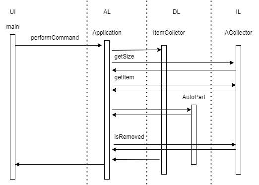

Министерство науки и высшего образования Российской Федерации  
Федеральное государственное бюджетное образовательное учреждение  
высшего образования  
«Московский государственный технический университет  
имени Н.Э. Баумана  
(национальный исследовательский университет)»  
(МГТУ им. Н.Э. Баумана)

ФАКУЛЬТЕТ ИНФОРМАТИКА И СИСТЕМЫ УПРАВЛЕНИЯ  
КАФЕДРА КОМПЬЮТЕРНЫЕ СИСТЕМЫ И СЕТИ (ИУ6💪)

 

ОТЧЕТ  
к лабораторной работе №2  
по дисциплине "Современные технологии разработки  
программного обеспечения"  
Реализация приложения в многоуровневой архитектуре  
с использованием удалённого репозитория кода

 

Преподаватель: Фетисов М.В.

Студент группы ИУ6-54Б Молчанов Даниил Андреевич
Студент группы ИУ6-52Б Левкович Игорь Алексеевич

## Описание задания

Задача № 13: "Магазин автозапчастей" ⚙️. На основании информации о сделанных и выполненных заказах, а также наличии автозачасти на складе, необходимо сделать заказ на пополнение склада с автозапчастями.

## Адрес проекта

Проект хранится в репозитории по адресу: [https://gitlab.bmstu.ru/msdt/2023/iu6-54b-damolchanov_iu6-52b-ialevkovich/l1](https://gitlab.bmstu.ru/msdt/2023/iu6-54b-damolchanov_iu6-52b-ialevkovich/l2).

## Документация 

[Диаграммы классов создаются автоматически при обновлении ветки main в удаленном репозитории GitLab и выкладываются в "страницы" проекта]

[Отчёт о покрытии тестами создаётся автоматически при обновлении ветки main в удаленном репозитории GitLab и выкладываются в "страницы" проекта]

## Диаграмма последовательности

Последовательность выполнения команды view:

## Выводы

Приобретены навыки описания модели предметной области. Выполнена ее изоляции, а также изучена работа с внешнием репозиторием кода и сценарием непрерывной интеграции. Написаны тесты и построена диаграмма последовательности.
